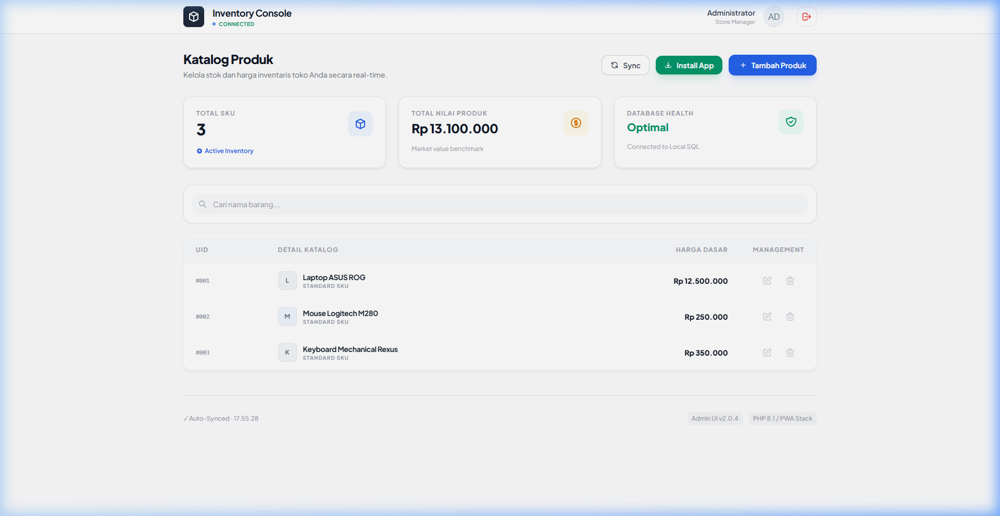
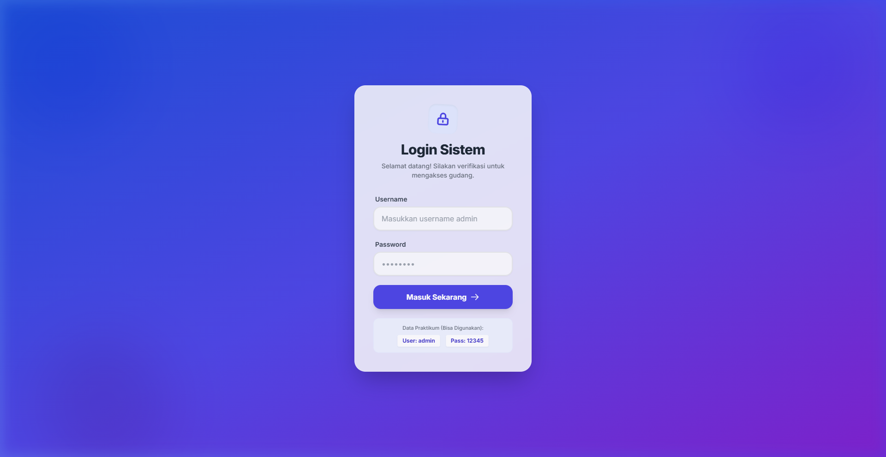
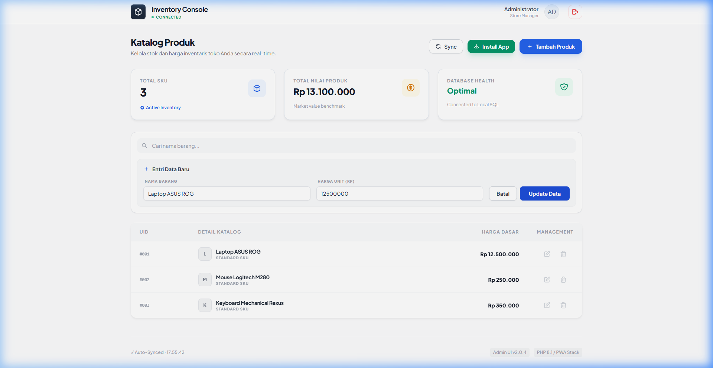

# 📦 Toko Barang — Professional Inventory Console

An implementation of a professional **Inventory Management Dashboard** using a **PHP PDO API (Backend)** and a **Vanilla JS + Tailwind CSS (Frontend)**. This project focuses on Single Page Application (SPA) experience and Progressive Web App (PWA) capabilities.

---

## 👤 Identitas Mahasiswa

| 🏷️ Field | 📝 Keterangan |
| :--- | :--- |
| **Nama Lengkap** | Muhammad Fajriska Maulana |
| **NIM** | `231220044` |
| **Kelas** | 31 |
| **Program Studi** | Teknik Informatika |
| **Instansi** | Universitas Muhammadiyah Pontianak |
| **Dosen Pengampu** | Sucipto, M.Kom |

---

## 🚀 Fitur Utama

-   **💎 Modern UI/UX**: Dibangun dengan Tailwind CSS, menggunakan efek glassmorphism, mikro-animasi halus, dan desain responsif mobile-first.
-   **📶 PWA Ready**: Dapat diinstal di Android, iOS, dan Desktop dengan ketahanan offline melalui Service Workers.
-   **🔒 Token-Based Security**: Penguncian API menggunakan Bearer tokens dan logic guard pada halaman login.
-   **🔄 Real-time Sync**: Sinkronisasi data otomatis di latar belakang setiap 5 detik untuk menjaga inventaris tetap update.
-   **⚡ SPA Workflow**: Operasi CRUD yang cepat tanpa reload halaman menggunakan Fetch API.
-   **📊 Smart Analytics**: Penghitungan SKU real-time dan evaluasi total nilai inventaris.
-   **🔍 Live Filter**: Kemampuan pencarian instan untuk produk dan kategori.
-   **⚙️ Zero-Config Deployment**: Deteksi environment otomatis untuk transisi mulus antara Local (Laragon) dan Production (InfinityFree).

---

## 🛠️ Tech Stack

---

## 📷 UI Preview

### 🔐 Login System
Antarmuka login glassmorphism yang bersih dan aman.

### 📊 Main Dashboard
Manajemen inventaris bersih dengan statistik real-time.

### ✍️ Intelligent Edit Mode
Transisi mulus ke mode pengeditan dengan auto-scroll dan tombol dinamis sesuai konteks.

---

## 📁 Struktur Repository

- `api-toko/`: Endpoint PHP PDO API (`get_barang.php`, `tambah_barang.php`, `delete_barang.php`, `update_barang.php`).
- `app-toko/`: Aset Frontend (`index.html`, `app.js`, `manifest.json`, `sw.js`).
- `database.sql`: MySQL Schema dan Data Sampel.

---

## 🔗 Live Demo
- **GitHub Repository**: [https://github.com/autumsov/PmrgmPlatform](https://github.com/autumsov/PmrgmPlatform)
- **Live Hosting**: [https://tokobarang.free.nf/app-toko/index.html](https://tokobarang.free.nf/app-toko/index.html)

---

  <i>Developed with ❤️ for PjBL Project — © 2026</i>

